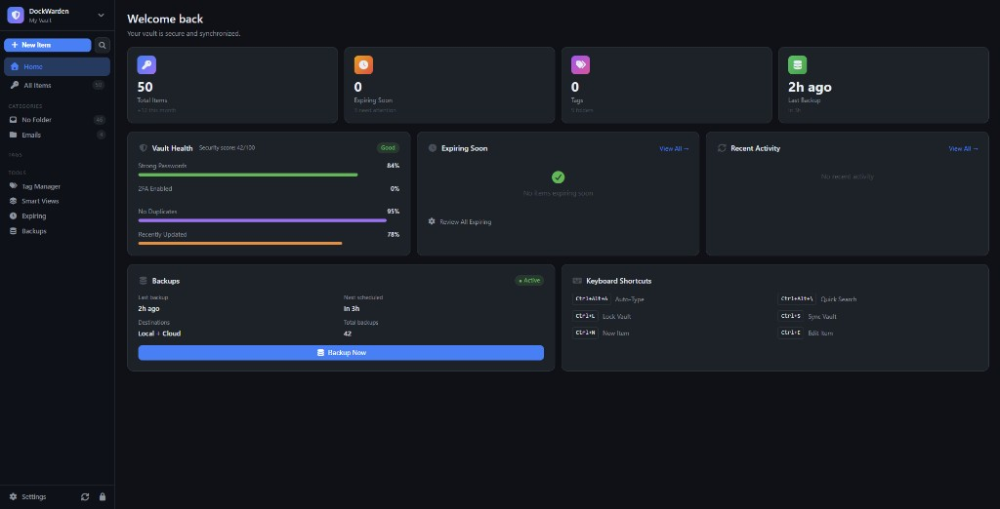
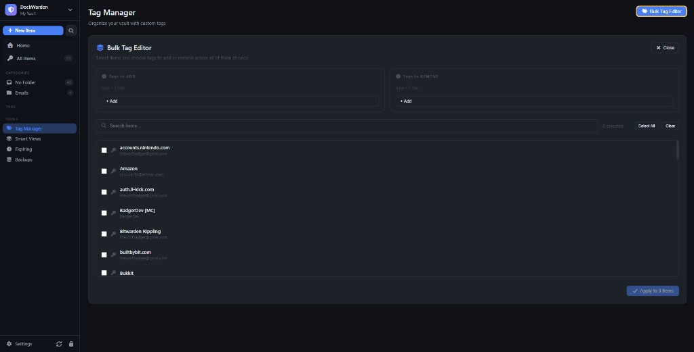
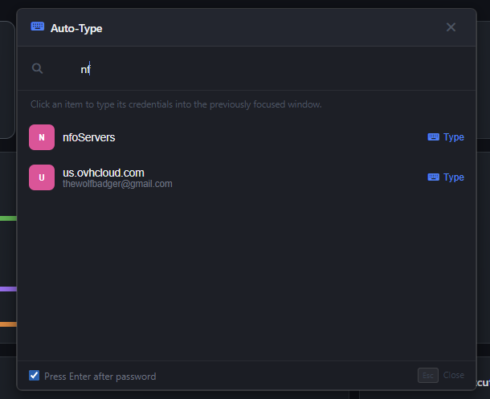
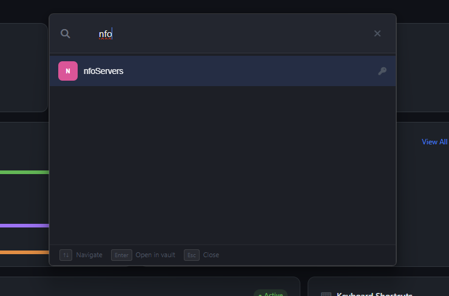
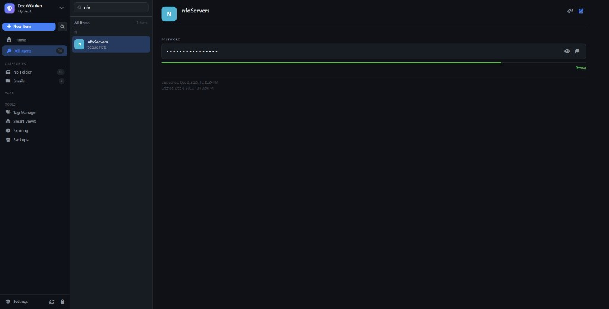
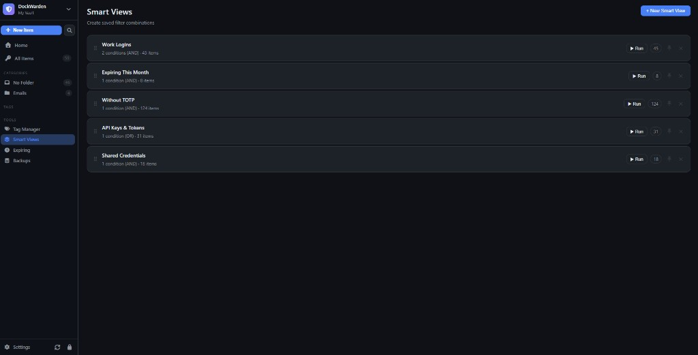
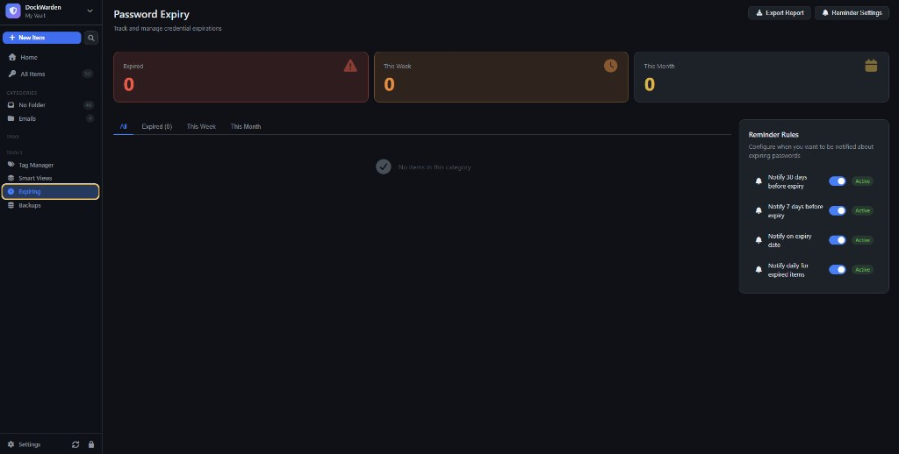
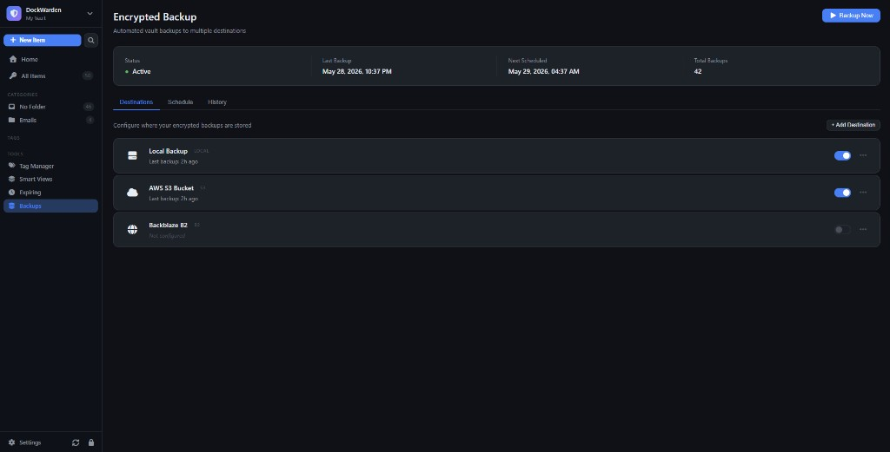
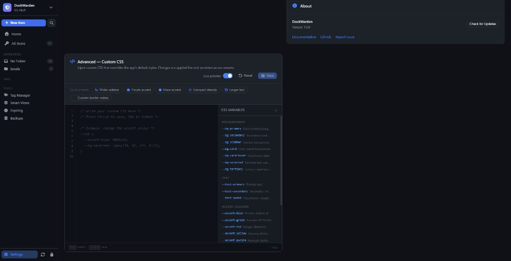
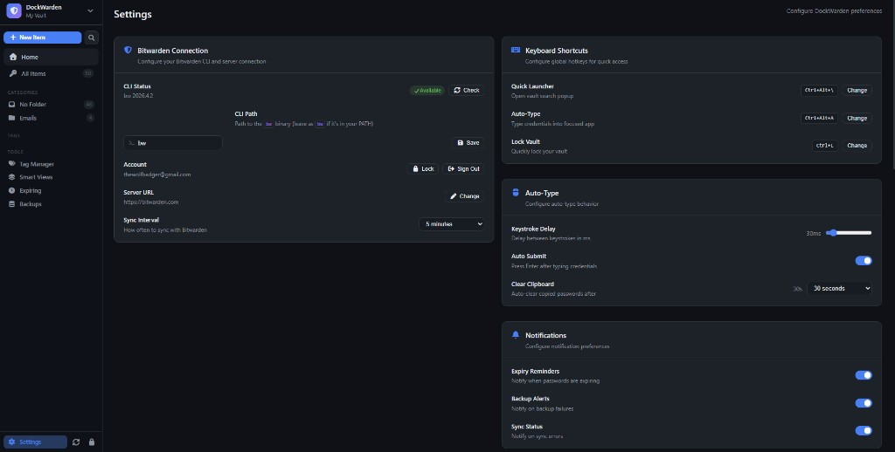

<div align="center">

# 🛡️ DockWarden

### A power-user companion app built on top of Bitwarden.

**Tags · Multi-Tag Filtering · Auto-Type · Quick Generate · Offline Edit Queue · At-Risk Labels · Markdown Notes · Smart Views · Expiry Policies · Quick Launcher · Multi-Account · Snapshot Diffing · Custom Icons · Clipboard Auto-Clear · TOTP Panel · Vault Item Templates · Visual Nested Folders · Watchtower Security Dashboard**

[](https://electronjs.org)
[](https://angular.dev)
[](https://bitwarden.com/help/cli/)
[](./LICENSE)

<br/>



</div>

---

## 🤔 What is DockWarden?

Bitwarden is an exceptional password manager — open-source, self-hostable, and trusted by millions. DockWarden is a desktop companion app that builds directly on top of it, adding a layer of power-user workflows that close the gap with tools like **1Password** — without asking you to leave Bitwarden.

Everything DockWarden does uses the **official Bitwarden CLI** under the hood. Your vault stays in Bitwarden, your credentials stay encrypted by Bitwarden, and your account stays under your control. DockWarden simply extends what you can do with it.

### Why not just switch to 1Password?

1Password has a strong feature set, but it is a **closed-source, proprietary SaaS product**. Bitwarden is open-source and self-hostable. For many users — individuals, businesses, and security-conscious teams — those properties are non-negotiable. DockWarden lets you keep all of Bitwarden's advantages and gain the desktop experience quality you'd expect from 1Password.

| Feature | 1Password | Bitwarden (native) | DockWarden + Bitwarden |
|---|:---:|:---:|:---:|
| Tag / label system | ✅ | ❌ | ✅ |
| **Multi-tag simultaneous filtering** | ✅ | ❌ | ✅ |
| Auto-Type into native apps | ✅ | ❌ | ✅ |
| Global quick-search launcher | ✅ | ❌ | ✅ |
| Auto-select top search result | ✅ | ❌ | ✅ |
| Click any field box to copy | ✅ | ❌ | ✅ |
| Smart filters / saved searches | ✅ | ❌ | ✅ |
| Password expiry alerts | ✅ | ❌ | ✅ |
| **Policy-based expiry (e.g. "90-day rotation")** | ✅ | ❌ | ✅ |
| **Multi-account switching with color coding** | ✅ | ❌ | ✅ |
| **Vault snapshot diffing (audit trail)** | ❌ | ❌ | ✅ |
| **Customizable vault item templates** | ❌ | ❌ | ✅ |
| **Visual nested folder manager** | ✅ | ❌ | ✅ |
| **Watchtower security dashboard** | ✅ | ❌ | ✅ |
| **Quick Generate (one-click create + save + auto-type)** | ✅ | ❌ | ✅ |
| **Offline edit queue with conflict resolver** | ❌ | ❌ | ✅ |
| **At-risk password reason labels (Weak / Reused / Breached pills)** | ✅ | ❌ | ✅ |
| **Markdown rendering in secure notes** | ❌ | ❌ | ✅ |
| **Custom local icons / favicons (no CDN)** | ❌ | ❌ | ✅ |
| **Clipboard auto-clear with toast countdown** | ✅ | ⚠️ (extension only) | ✅ |
| **TOTP panel — all codes at a glance** | ✅ | ❌ | ✅ |
| Scheduled encrypted backups | ❌ | ❌ | ✅ |
| Open source | ❌ | ✅ | ✅ |
| Self-hostable vault | ❌ | ✅ | ✅ |
| Custom CSS / theming | ❌ | ❌ | ✅ |

> Your **vault data never leaves Bitwarden**. Tags, expiry dates, and other metadata are written to Bitwarden's own custom fields — encrypted at rest in your Bitwarden vault.

---

## ✨ Features

### 🏷️ Tag & Label Manager with Multi-Tag Filtering

Bitwarden's folder system is great for broad organisation, but power users often want to cross-reference items with multiple labels. DockWarden adds a **multi-tag system** stored transparently in custom fields (`_dw_tags`), so your tags are preserved in your Bitwarden vault regardless of what app you use to access them.

- **Bulk editor** — select multiple items, apply or remove tags in one action
- **Tag cloud sidebar** — click any tag to instantly filter the item list; **click a second tag to add it to the filter**
- **AND / OR mode toggle** — filter to items that have ALL selected tags (AND) or ANY of them (OR)
- **Smart tag suggestions** — see existing tags as you type
- **Merge & rename** — combine duplicate tags across your entire vault

The **Labels/Tags feature request** has 267 replies and over 62,000 views on the Bitwarden community forum — one of the most-requested features ever. Multi-tag filtering lets you finally slice your vault the way power users have always wanted.



---

### ⌨️ Auto-Type *(Windows — Mac coming)*

Press `Ctrl+Alt+A` from **any application**. A floating picker appears on the monitor you're working on. Select the entry — DockWarden minimises itself and types **username → Tab → password → Enter** directly into whatever window had focus before you pressed the shortcut.

- Works with any native app: SSH terminals, legacy desktop apps, RDP sessions, anything
- No browser extension required
- Configurable: type only password, only username, with or without Enter
- Powered by Windows `SendKeys` (no extra dependencies to install)



---

### 🔍 Global Quick Launcher

A **Spotlight/Alfred-style popup** triggered by `Ctrl+Alt+\` that floats on whatever monitor your cursor is on, completely independent of the DockWarden main window.

- Instant fuzzy search across your entire vault (cached in memory — no CLI round-trip)
- `↑↓` to navigate, `Enter` to open the item in the main vault view
- Dismisses when you click away
- Opens on **the monitor you're working on**, not on the DockWarden window



---

### 📡 Offline Edit Queue

DockWarden caches your vault in memory — and now that cache backs you up when connectivity drops. If `bw sync` fails due to a network error, DockWarden silently switches to **offline mode** and continues accepting edits and new item creation without any interruption to your workflow.

- **Automatic detection** — no manual toggle; DockWarden detects the network failure on sync and starts queuing transparently
- **Encrypted at rest** — the queue is encrypted with `electron.safeStorage` (OS keychain / DPAPI) before being persisted to disk; passwords are never stored in plaintext
- **Optimistic UI** — edited and newly created items appear in the vault immediately, clearly marked as pending, so your workflow isn't blocked
- **Amber status banner** — a subtle bottom banner shows how many edits are pending and lets you flush the queue with one click the moment you're back online
- **Conflict resolver** — if an item was edited both offline and on the server (e.g. from the Bitwarden web app), a side-by-side conflict resolver lets you choose per-item: keep your offline change or keep the server version
- **Queue drawer** — open the queue at any time to review pending operations and discard any you no longer want
- **Survived app restart** — the encrypted queue is loaded from disk on the next launch; nothing is lost even if the app is closed while offline

> Deletes are intentionally **not** queued — they require a live connection to prevent silent data loss from race conditions.

---

### ⚡ Quick Generate

Press `Ctrl+Alt+G` from **any application** (or click the ⚡ button in the sidebar) to instantly open a floating credential generator. Before stealing focus, DockWarden reads the title of the currently active window and pre-fills the site name for you — no copy-pasting required.

- **One-click workflow** — generates a strong, cryptographically random password and creates the vault entry in a single action
- **Three save modes** — *Save & Auto-Type* (types credentials directly into the site), *Save & Copy* (copies password to clipboard), or *Save Only*
- **Default username** — set a preferred email or username in Settings; it pre-fills every time you open the generator
- **Inline generator options** — adjust length (8–64), and toggle character sets (A–Z, a–z, 0–9, symbols) directly in the popup
- **Password strength indicator** — live Weak / Fair / Good / Strong badge on the generated password
- **Folder assignment** — optionally drop the new item straight into a vault folder
- **Keyboard-first** — `Ctrl+Enter` triggers Save & Auto-Type; `Esc` closes; `↺` regenerates without saving
- **Context-aware site detection** — parses "Dashboard — Google Chrome" style window titles to extract a clean hostname

Configure the default username and generator preferences any time from **Settings → Quick Generate**.

---

### 🏷️ At-Risk Password Reason Labels

When Watchtower flags an item it now tells you **exactly why** — right on the item itself, without opening the Watchtower dashboard. Each risk is surfaced as a compact, color-coded pill badge alongside the item in the vault list, and as a full-detail "Security Alerts" section in the item detail panel.

| Badge | Color | Meaning |
|---|---|---|
| **Breached** | Red | Password found in a known data breach (HIBP k-anonymity) |
| **Weak** | Amber | Password scores 0–2 on zxcvbn |
| **Reused** | Orange | Same password used across two or more items |
| **HTTP** | Yellow | Login URL uses insecure HTTP |
| **No 2FA** | Purple | Site likely supports TOTP but no 2FA is configured |
| **Duplicate** | Grey | Item is a near-identical copy of another entry |

- Pills appear **inline in the item list** — scannable at a glance without clicking into anything
- Hovering a pill shows the **full Watchtower message** as a tooltip
- Opening an item surfaces a **Security Alerts section** in the detail panel with the full label and explanation for each finding
- Labels update **reactively** — as soon as a Watchtower scan completes or you dismiss a finding, all badges update instantly everywhere

---

### 📝 Markdown Rendering in Secure Notes

Secure notes and item notes are now rendered as **live Markdown** in the detail panel — stored as plain text in Bitwarden exactly as before, just displayed beautifully in DockWarden.

- **View mode**: rendered by default — headings, bold/italic, lists, blockquotes, fenced code, tables, and links all styled to match the DockWarden dark theme
- **Raw / Preview toggle**: a small button in the Notes label row switches between the rendered output and the original markdown source
- **Edit mode**: a monospace textarea (because writing markdown in monospace just feels right) with a **live preview panel** that updates character-by-character as you type; the preview can be shown side-by-side or collapsed to single-column with one click
- **Security-first**: all rendered HTML passes through [DOMPurify](https://github.com/cure53/DOMPurify) with a strict allowlist before being injected — no XSS possible even if your notes contain malicious HTML fragments
- External links in notes open in a new tab with `rel="noopener noreferrer"` enforced by the custom link renderer
- Nothing changes in Bitwarden — the note is stored and synced as plain text; markdown is a DockWarden-only rendering layer

---

### 🔎 Auto-Select Top Search Result

One of the most-cited quality-of-life differences between 1Password and Bitwarden's desktop app is how search behaves. In 1Password, the best match is selected and its details opened automatically as you type. DockWarden brings the same behaviour to the Bitwarden vault browser.

- Start typing in the search box — the top fuzzy-matched result is **automatically selected and shown** in the detail panel on the right
- No need to click the result first
- Clearing the search returns to your previous selection
- Works the same way in the Quick Launcher floating window



---

### ◈ Smart Views

Save complex filter combinations as named "Smart Views" that act like dynamic folders. **Pin any Smart View to the sidebar** to see its live item count and jump straight to the filtered list.

- Filter by: tag, folder, item type, expiry window, favourite status, TOTP presence
- **AND / OR operators** — build precise queries
- **Pinned views** appear in the sidebar with live counts, exactly like folders
- Used as the backbone of the expiry dashboard and tag-based workflows



---

### ⏰ Password Expiry Reminders & Rotation Policies

DockWarden goes beyond simple expiry date fields — it introduces **policy-based credential management** that proactively flags stale passwords even if you haven't set a per-item date.

#### Per-Item Expiry Tracker
- **Dashboard** — grouped view: Expired · Expiring This Week · Expiring This Month
- **System tray notifications** — 30, 7, and 1 day before expiry
- **Configurable reminder rules** — adjust lead times per item type
- Edit expiry dates inline in the item detail panel

#### Policy Dashboard *(new)*
The community specifically asked for **policy-based expiry** — e.g., "flag any password older than 90 days as stale" — rather than relying solely on per-item dates. DockWarden's Policy Dashboard delivers exactly this.

- **Create rotation policies** — e.g. "90-Day Rotation" or "Annual Review"
- Each policy specifies: threshold (days since last modified), item types to check, and advance notification window
- **Violation dashboard** — see every credential that violates each active policy, sorted by staleness
- **AND/OR item type scope** — apply a policy to logins only, or cards + logins together
- Policies are stored locally; vault items are evaluated in memory — nothing extra written to Bitwarden
- Enable / disable policies with a single toggle



---

### 👤 Multi-Account Switching

Many users have both a personal and a work Bitwarden account. DockWarden makes switching between them frictionless, with **visual color coding** so you always know which vault you're working in.

- Accounts are automatically saved as profiles on first login
- **Color-coded sidebar header** — each account has a distinct accent color shown in the brand logo and sidebar
- **Account switcher dropdown** — click the DockWarden logo in the sidebar to see all saved profiles
- Switching accounts locks the current vault and pre-fills the email on the unlock screen — just enter your password
- Manage and remove profiles from **Settings → Account Profiles**
- Works with personal accounts, business accounts, and self-hosted Bitwarden servers

---

### 💾 Scheduled Encrypted Backup

DockWarden wraps `bw export --format encrypted_json` in a configurable cron job that runs silently in the background.

- **Destinations:** Local folder · AWS S3 · Cloudflare R2 · Backblaze B2 · WebDAV
- **Schedule:** Hourly · Daily · Weekly · On every vault sync
- **Retention policy** — automatically prune old backups
- **Backup history** with file size, status, and destination path
- One-click restore verification



---

### 🔍 Vault Snapshot Diffing

DockWarden automatically snapshots your vault metadata every time you sync, giving you an **audit trail of changes** over time. You can also save manual snapshots at any moment.

- Every vault sync **auto-saves a lightweight snapshot** (item names, types, last-modified timestamps)
- **Save named snapshots** before a big change: "Before bulk delete", "Before sharing with team"
- **Compare any two snapshots** side by side — Added, Deleted, Modified, and Unchanged items are clearly flagged in color
- Stored locally (up to 50 snapshots) — **no external requests, fully private**
- Found in **Backup → Snapshot Diff** tab

> "These 5 items were added, 2 were modified, 1 was deleted since your last sync" — instantly visible.

---

### 🎨 Custom Icons / Favicons per Entry

Bitwarden auto-fetches favicons from a remote CDN, which has **privacy implications** (external requests for every site in your vault). DockWarden lets you set icons locally — no external requests ever.

- **Click the avatar** on any item's detail panel to open the icon picker
- Choose from a **curated emoji set** or pick a **color + initials** combination
- Custom icons persist in DockWarden's local store and are shown everywhere: item list, detail panel, and the TOTP panel
- **Reset to default** at any time — the generated color-coded initials are still there as a fallback
- Zero network requests — completely private and offline

---

### 📋 Clipboard Auto-Clear with Countdown Toast

When you copy a sensitive field (password, TOTP, card number), DockWarden shows a **non-intrusive toast** in the bottom-right corner counting down to clipboard clearance.

- **Visual countdown bar** so you always know how long until the clipboard is wiped
- **One-click Cancel** if you still need the value on the clipboard
- **Configurable delay**: 10s · 15s · 30s · 60s · Never — set in **Settings → Security**
- Uses the native OS clipboard, so it works across all apps — not just in the browser like Bitwarden's extension
- Setting is persisted across app restarts

---

### 🛡️ TOTP Code Panel

Bitwarden supports TOTP codes, but buries them deep inside individual item views. DockWarden surfaces **all your expiring codes at a glance** in a dedicated panel.

- **All TOTP codes in one grid view** — no more clicking into each item to find the code
- **Live countdown ring** on every card showing seconds remaining before code rotation
- **Visual urgency**: green → yellow → red as the code approaches expiry
- **Critical pulse animation** when a code has less than 5 seconds left
- **Click any card** to copy the code (also respects the clipboard auto-clear setting)
- **Search/filter** by item name or username
- **Respects custom icons** — your emoji and color icons show here too
- Codes are generated **client-side** using Web Crypto API — the TOTP secret never leaves your device

Access via **TOTP Codes** in the sidebar tools section (Ctrl+click to focus quickly).

---

### 📐 Customizable Vault Item Templates

Bitwarden's fixed item types — Login, Card, Identity, Secure Note — stop power users cold. Where do you store an SSH server's key path? A database's SSL cert? An API key's environment and expiry? DockWarden solves this with **Vault Item Templates**: a fully customizable field structure that travels inside your Bitwarden vault.

#### How it works

Templates are stored in your local DockWarden profile. When you create a new item from a template, the template's custom fields are written directly to Bitwarden's own custom field system — **encrypted at rest in your vault**, visible in any Bitwarden client, never requiring DockWarden to store secrets separately.

#### Six built-in templates out of the box

| Template | Fields |
|---|---|
| 🖥️ **SSH Server** | Host · Port · Key Path · Sudo Password |
| 🔌 **API Key** | API Key · Secret · Endpoint · Environment · Key Expiry |
| 🗄️ **Database** | Host · Port · Database Name · SSL Certificate |
| 📋 **Software License** | License Key · Seats · Purchase Date · Renewal Date · Vendor |
| 📶 **Wi-Fi Network** | SSID · Band · Router IP |
| ☁️ **AWS Credentials** | Access Key ID · Secret Access Key · Region · Account ID |

#### Template Builder

Open **Templates** in the sidebar to build your own:

- **Name, icon, and color** — choose from 24 emoji icons and 10 accent colors
- **Base type** — Login (default) or Secure Note
- **Default folder** — automatically assigned when you create from this template
- **Custom fields** — add any number of named fields, each with:
  - **Type**: Text · Hidden (masked) · URL · Toggle (boolean)
  - **Default value** — pre-filled when the new item modal opens
  - **Placeholder hint** — shown as greyed-out text inside the field
  - **Required flag** — visually marked in the creation form
- **Field ordering** — reorder fields with up/down arrows

#### Template picker in the New Item flow

Press `Ctrl+N` to open the New Item modal. Instead of jumping straight to a blank form, a **visual picker** appears first:

```
What type of item?
──────────────────────────────────
  Standard Types
  [🔑 Login]  [📝 Secure Note]

  Built-in Templates
  [🖥️ SSH Server]  [🔌 API Key]  [🗄️ Database]
  [📋 License]     [📶 Wi-Fi]    [☁️ AWS]

  My Templates
  [🎮 Game Account]  [🏠 Home Server]
──────────────────────────────────
               [Cancel] [+ Create Template]
```

Select any card to move to the fill-in form, where standard fields (username, password, website) are shown alongside the template's custom fields — pre-filled with your default values. A back arrow lets you return to the picker without losing what you typed.

#### Import / Export

Share template definitions with your team or the community as JSON snippets:

- **Export** — click Export on any template to get a portable JSON you can paste anywhere
- **Import** — paste community-contributed JSON to add a template instantly
- Template packs (e.g. "DevOps bundle", "homelab bundle") can be shared as a single JSON file

> Your vault data never leaves Bitwarden. Templates are definitions only — secrets are always encrypted by Bitwarden.

---

### 🗂️ Visual Nested Folder Manager

Bitwarden technically supports nested folders — but only if you manually type names like `Personal/Email/Work` and remember the delimiter. There's no visual tree, no drag-and-drop, no context menu. DockWarden turns Bitwarden's slash-delimited names into a **proper interactive folder hierarchy** that feels like a native file explorer.

#### Visual folder tree in the sidebar

The sidebar's CATEGORIES section is replaced with a live folder tree:

```
▼ 📁 Personal              12
    📁 Email                5
  ▶ 📁 Work                 7
      📁 HR                  2
      📁 Projects            5
  📁 Finance                 3
+ Add folder
  ⚙ Manage Folders
```

- **Expand / collapse** — click the `▶` chevron or the folder row to toggle children; state is persisted in memory across navigation
- **Hover actions** — hovering a row reveals two tiny icon buttons: `+` (new subfolder inline) and `⋮` (opens Rename / Delete menu)
- **Inline rename** — clicking Rename replaces the label with a text input; press `Enter` or `Escape` to confirm/cancel; renames cascade to all child folders automatically
- **Inline new subfolder** — clicking `+` inserts an input directly below the parent row; the new folder appears in the tree immediately on creation
- **Delete** — shows a one-click confirmation bar in place of the row; deleted folders don't delete items — they become unfiled
- **Item counts** — badges show the total item count including all descendants so you always know what's inside collapsed nodes
- **Drag vault items to folders** — drag any item row from the vault browser and drop it onto a folder row in the sidebar to move it instantly

#### Nested folder filtering

Clicking any folder in the sidebar now shows **all items in that folder and every subfolder beneath it** — not just the exact folder. Clicking "Personal" shows items from "Personal", "Personal/Email", "Personal/Work", and so on, giving you a true tree-inclusive view.

#### Folder Manager page

A dedicated **`/folders`** page provides a full-width management experience:

- **Drag-to-reparent** — drag any folder row onto another to make it a child; all descendant paths are updated in Bitwarden via the CLI automatically
- **Move dialog** — for each folder, a "Move to…" dropdown lets you select a new parent without dragging
- **Create / rename / delete** — full CRUD with cascade rename for parent folders
- **Expand / Collapse All** buttons in the toolbar
- **Item panel** — selecting a folder shows all items in its subtree on the right, with a per-item "Move to folder" action and a "Browse in Vault" button
- **Drag items between folders** — item rows in the detail panel are draggable, and folder rows in the sidebar act as drop targets

> Under the hood it's all `bw create folder`, `bw edit folder`, and `bw delete folder` calls — the vault structure always lives in Bitwarden. DockWarden just makes the UX instant and visual.

---

### 🖱️ Click-to-Copy Fields

A small but frequently requested UX improvement: clicking anywhere on a username, password, website, or card number field box copies the value to your clipboard instantly — no need to aim for the small copy icon.

- The entire field row is the click target
- A copy icon appears on hover as a visual hint
- The row flashes green and the icon turns to a checkmark to confirm the copy
- The eye/reveal button for passwords is intentionally separate and does **not** trigger a copy


---

### 🛡️ Watchtower — Security Intelligence Dashboard

Watchtower is DockWarden's built-in security monitor, inspired by 1Password's Watchtower but architected entirely on your device — no backend server, no telemetry, and nothing leaves your machine in identifiable form.

**What it checks:**

| Check | How it works | Privacy |
|---|---|---|
| **Breached Passwords** | SHA-1 hash of each password; only the first 5 hex characters are sent to the [Have I Been Pwned API](https://haveibeenpwned.com/API/v3#SearchingPwnedPasswordsByRange) (k-Anonymity model) | HIBP never sees your password or the full hash |
| **Weak Passwords** | Local entropy analysis via **zxcvbn** — no network call | Fully offline |
| **Reused Passwords** | Cross-item comparison of hashed passwords | Fully offline |
| **Insecure Websites** | URI scheme check (HTTP vs HTTPS), excluding localhost | Fully offline |
| **Missing Two-Factor** | Cross-references your vault items with a static list of 2FA-capable domains | Fully offline |
| **Duplicate Items** | Same URI + same username across multiple items | Fully offline |

**The dashboard:**

- **Vault Health Score (0-100)** — a weighted composite of five sub-scores: Breach-Free, Strength, Uniqueness, HTTPS, and 2FA Coverage, rendered as an animated progress ring
- **Per-category findings** — collapsible sections, each showing affected items with issue description and detail
- **Per-finding actions** — dismiss a finding permanently, or snooze it for 7 or 30 days
- **Scan progress bar** — real-time phase indicator as the scan moves through each check category
- **Sidebar badge** — a red counter on the Watchtower nav item shows critical issue count at a glance
- **System tray tooltip** — the tray icon tooltip reflects total issues and critical count after every scan; updates live as you dismiss findings
- **Auto-clear on lock** — all scan results are erased from memory when the vault locks
- **Settings panel** — gear icon on the Watchtower page exposes per-check toggles (enable/disable any of the six checks individually) and an auto-scan on unlock toggle; settings persist across restarts
- **Auto-scan on unlock** — when enabled in settings, a scan starts automatically 1.5 s after vault unlock (giving vault items time to load)

**Privacy architecture:**

- Passwords are never sent anywhere in full — only the 5-character SHA-1 prefix goes to HIBP
- The `Add-Padding: true` header prevents response-length fingerprinting
- Worker-level isolation: all sensitive data is processed and discarded in the main process; results contain only item names and messages, never raw credentials
- Results are ephemeral — not written to `dockwarden-store.json` or any disk file

**How to run a scan:**

1. Navigate to **Watchtower** in the sidebar
2. Click **Run Security Scan**
3. The breach check queries HIBP at ~8 requests/second (rate-limited to stay under the 10/sec free tier limit)
4. All other checks run instantly; a typical 100-item vault completes in under 30 seconds

---

### 🎨 Custom CSS Editor *(unique to DockWarden)*

A fully-featured in-app CSS editor under **Settings → Advanced**. Retheme the entire application without touching any source files — changes persist across restarts and are applied live as you type.

- **Live preview** — 400 ms debounce applies CSS as you type
- **Quick presets** — one-click to try wider sidebar, purple/rose accent, compact density
- **CSS variables reference** — collapsible panel listing every `--variable` with a click-to-copy
- Line-number gutter · Tab indentation · `Ctrl+S` to save · `Reset` to undo all changes



---

## 🖥️ Screenshots Gallery

| Home Dashboard | Item Browser |
|:---:|:---:|
|  |  |

| Quick Launcher | Auto-Type Picker |
|:---:|:---:|
|  |  |

| Tag Manager | Smart Views |
|:---:|:---:|
|  |  |

| Expiry Dashboard | Encrypted Backup |
|:---:|:---:|
|  |  |

| Custom CSS Editor | Settings |
|:---:|:---:|
|  |  |

---

## ⚡ Quick Start

### Prerequisites

- **Node.js** 18+
- **Bitwarden CLI** — install once:
  ```bash
  npm install -g @bitwarden/cli
  bw --version   # should print e.g. 2024.x.x
  ```

### Development (hot reload)

```bash
# 1. Clone
git clone https://github.com/JaredScar/DockWarden.git
cd DockWarden/dockwarden

# 2. Install
npm install

# 3. Build Angular in watch mode + launch Electron
npm run electron:dev
```

### Production build

```bash
npm run electron:build
# → packaged installer in dockwarden/release/
```

### Run against an existing build

```bash
npm run build        # Angular production build
npm run electron     # Launch Electron against dist/
```

---

## 🔑 Keyboard Shortcuts

| Shortcut | Action |
|---|---|
| `Ctrl+Alt+\` | Open Quick Launcher (on active monitor) |
| `Ctrl+Alt+A` | Open Auto-Type picker (on active monitor) |
| `Ctrl+Alt+G` | Open Quick Generate — create, save & auto-type a new login |
| `Ctrl+N` | New vault item |
| `Ctrl+E` | Edit selected item |
| `Ctrl+S` | Sync vault with Bitwarden |
| `Ctrl+L` | Lock vault |

> Quick Launcher, Auto-Type, and Quick Generate open as **independent floating windows on the monitor your cursor is on** — not inside the DockWarden window.

---

## 🔒 Security Model

DockWarden is designed with a minimal attack surface:

- **No credentials stored by DockWarden** — authentication is handled entirely by the official `bw` CLI; the session key lives only in memory for the lifetime of the app process
- **contextBridge isolation** — the Angular renderer has no access to Node.js or IPC directly; it communicates only through a typed, allowlisted surface defined in `preload.js`
- **Metadata in your vault** — tags and expiry dates are written to Bitwarden custom fields (not a local database), so they are encrypted at rest by Bitwarden
- **Open source** — full source available for review

---

## 🛠️ Tech Stack

| Layer | Technology |
|---|---|
| App shell | Electron 42 |
| UI framework | Angular 21 (standalone components, signals, OnPush) |
| State management | Angular Signals — `signal()`, `computed()` |
| Vault integration | Bitwarden CLI (`bw`) via `child_process` |
| Fuzzy search | `fuse.js` |
| Config persistence | `electron-store` |
| Keyboard simulation | Windows `SendKeys` via PowerShell (Windows); `nut-js` planned for Mac |
| Build & distribution | `electron-builder` |

---

## 🗂️ Project Structure

```
dockwarden/
├── electron/
│   ├── main.js           # Main process: tray, IPC handlers, global shortcuts,
│   │                     # launcher window management, auto-type execution
│   └── preload.js        # contextBridge — fully typed ElectronAPI surface
└── src/app/
    ├── core/
    │   ├── vault.service.ts        # Items cache, auth state, CRUD operations
    │   └── smart-view.service.ts   # Filter engine, pinned views
    ├── features/
    │   ├── home/           # Dashboard: stats, health score, expiry widget
    │   ├── items/          # Master-detail vault browser, inline edit
    │   ├── launcher/       # Quick Search floating window (dedicated route)
    │   ├── autotype/       # Auto-Type picker window (dedicated route)
    │   ├── tags/           # Tag manager + multi-select bulk editor
    │   ├── smart-views/    # Saved filter builder, pin to sidebar
    │   ├── expiry/         # Expiry dashboard + reminder rules
    │   ├── backup/         # Backup destinations, schedule, history
    │   ├── settings/       # Preferences + Custom CSS editor
    │   ├── templates/      # Template builder, picker, JSON import/export
    │   ├── folders/        # Visual folder manager, drag-to-reparent, CRUD
    │   └── unlock/         # Login / unlock screen with 2FA support
    └── shared/
        └── models/         # TypeScript interfaces: VaultItem, Tag, SmartView, VaultTemplate…
```

---

## 🏗️ Angular 21 Architecture

DockWarden follows strict Angular 21 patterns:

- **Signals everywhere** — no `BehaviorSubject`, no RxJS for state management
- **`ChangeDetectionStrategy.OnPush`** on every component
- **Standalone components only** — no NgModules
- **Modern control flow** — `@if`, `@for`, `@switch` (no `*ngIf` / `*ngFor`)
- **`inject()` function** — no constructor injection
- **Lazy-loaded routes** — every feature bundle loaded on demand

```typescript
// Reactive vault state — pure signals
@Injectable({ providedIn: 'root' })
export class VaultService {
  private readonly _items = signal<VaultItem[]>([]);

  readonly items   = this._items.asReadonly();
  readonly stats   = computed(() => deriveStats(this._items()));
  readonly allTags = computed(() => deriveTags(this._items()));
}
```

---

## 🗺️ Roadmap

| Phase | Features | Status |
|---|---|---|
| ✅ Foundation | Electron scaffold, IPC surface, vault browser, tray | **Shipped** |
| ✅ Tag Manager | `_dw_tags` read/write, multi-tag, bulk editor, tag sidebar | **Shipped** |
| ✅ Multi-Tag Filtering | AND/OR filter bar, tag picker, simultaneous multi-tag filtering | **Shipped** |
| ✅ Quick Launcher | Global hotkey, multi-monitor floating window, fuzzy search | **Shipped** |
| ✅ Auto-Type | Global hotkey, picker window, PowerShell keystroke injection (Win) | **Shipped** |
| ✅ Smart Views | Filter builder, AND/OR, sidebar pinning, dynamic counts | **Shipped** |
| ✅ Expiry System | `_dw_expires` field, expiry dashboard, OS notifications | **Shipped** |
| ✅ Expiry Policies | Policy-based "90-day rotation" violations dashboard, per-policy items | **Shipped** |
| ✅ Multi-Account Switching | Color-coded profiles, sidebar switcher, Settings manager | **Shipped** |
| ✅ Encrypted Backup | `bw export` cron, local/S3/Backblaze, retention, history | **Shipped** |
| ✅ Custom CSS | Live-preview CSS editor, variable reference, presets | **Shipped** |
| ✅ Click-to-Copy Fields | Click any field box to copy; green flash confirmation | **Shipped** |
| ✅ Auto-Select Search | Top fuzzy match selected automatically as you type | **Shipped** |
| ✅ Auto-updater | Silent background updates via `electron-updater` + GitHub Releases | **Shipped** |
| ✅ Mac Auto-Type | `pbcopy` + `osascript` keystroke injection for macOS | **Shipped** |
| ✅ TOTP in Launcher | Click or `Tab` to copy live OTP code; countdown ring | **Shipped** |
| ✅ Vault Snapshot Diffing | Auto-snapshot on sync, manual snapshots, A/B diff viewer | **Shipped** |
| ✅ Custom Icons per Entry | Emoji, color+initials picker — zero CDN requests, private | **Shipped** |
| ✅ Clipboard Auto-Clear | Toast countdown, cancel button, configurable delay (10–60s) | **Shipped** |
| ✅ TOTP Panel | All codes at a glance, live countdown ring, urgency coloring, click-to-copy | **Shipped** |
| ✅ Vault Item Templates | Template builder, 6 built-in presets, two-step Ctrl+N picker, JSON import/export | **Shipped** |
| ✅ Visual Nested Folder Manager | Collapsible tree, drag-to-reparent, inline CRUD, cascade rename, nested filtering | **Shipped** |
| ✅ Watchtower Security Dashboard | HIBP k-Anonymity breach check, zxcvbn strength, reuse, insecure URIs, missing 2FA, duplicate detection, health score ring | **Shipped** |
| ✅ Quick Generate | Global `Ctrl+Alt+G` floating generator; auto-detects active window site name; Save & Auto-Type / Copy / Save Only; default username; persistent length + charset settings | **Shipped** |
| ✅ Offline Edit Queue | Auto-detects network failure on sync; safeStorage-encrypted queue; optimistic UI; amber status banner; per-item conflict resolver; queue drawer with discard; survives app restart | **Shipped** |
| ✅ At-Risk Password Reason Labels | Inline pill badges on every vault item showing exactly why it's flagged (Breached / Weak / Reused / HTTP / No 2FA / Duplicate); full Security Alerts section in detail panel; reactive on scan updates | **Shipped** |
| ✅ Markdown Rendering in Secure Notes | Live markdown preview (GFM, tables, code blocks, blockquotes) in detail panel; monospace edit textarea with side-by-side live preview; Raw toggle; DOMPurify sanitised; stored as plain text in Bitwarden | **Shipped** |
| 🚧 Cloud backup adapters | S3, Cloudflare R2, Backblaze B2, WebDAV live | Planned |

---

## 🤝 Contributing

Contributions are welcome! Please follow the Angular 21 standards defined in [`DockWarden-Plan.md`](./DockWarden-Plan.md): signals over RxJS, standalone components, `inject()` over constructor injection.

```bash
git checkout -b feature/my-feature
# make changes
git commit -m "feat: describe your change"
# open a pull request
```

---

## 📄 License

MIT © DockWarden Contributors

---

<div align="center">

**Built with ❤️ on top of Bitwarden — the best open-source password manager.**

⭐ If DockWarden is useful to you, consider starring the repository.

</div>
